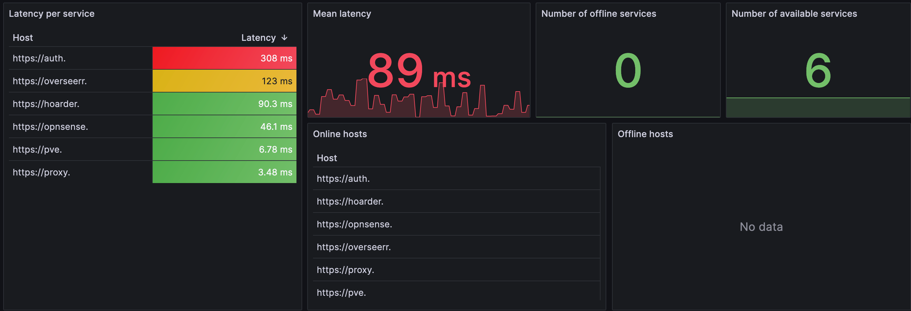
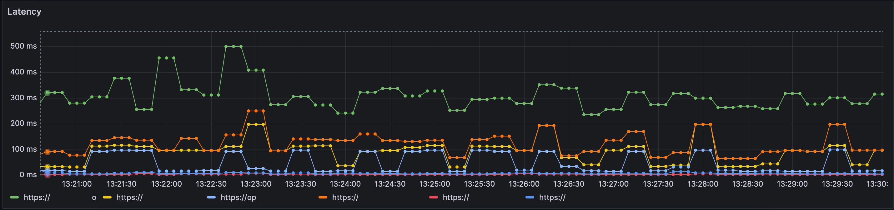

# uptimer
A flexible Prometheus-compatible uptime checker for your services. Useful to know if your services are working, and how long they take to respond.

[](./README.md)
[](https://github.com/shamelin/uptimer/releases)
[](./go.mod)
[](https://goreportcard.com/report/github.com/shamelin/uptimer)
[](https://github.com/shamelin/uptimer/actions/workflows/build.yaml)

## Demonstration
Uptimer can be used to monitor the uptime of your services directly from Grafana. You can spin up the service and point it to your other services, then create a Grafana dashboard to monitor the uptime of your services.




The dashboard is availle in the `grafana/dashboard.yaml` file. Be sure to edit the datasource `uid` to match yours.

## Features
- **Prometheus-compatible**: Expose metrics in Prometheus format.
- **Flexible**: Define your own checkers and check intervals.
- **Simple**: Easy to use and deploy.

## Metrics exposed
- `uptime_up`: Whether the remote service is up or not.
- `uptime_latency`: The latency between the uptimer and the remote service.
- `uptime_status_code`: The status code of the last request to the remote service.

## Configuration
You can either configure the service using environment variables or a configuration file.
The configuration file takes precedence over environment variables if both are provided.

### Environment variables
- `LOG_LEVEL`: The log level of the application. Default: `info`. Options: `debug`, `info`, `warn`, `error`, `fatal`, `panic`.
- `HOSTS`: A comma-separated list of hosts to check.
- `INTERVAL`: The default interval between checks in seconds. Default: `5s`.
  - You can specify specific interval for each hosts in the `config.toml` file.
- `TIMEOUT`: The timeout for each request in seconds. Default: `5s`.
  - You can specify specific timeout for each hosts in the `config.toml` file.
- `PORT`: The port to expose the metrics on. Default: `8080`.

### Configuration file
The configuration file is in TOML format and should be named `config.toml`.
An example configuration file is provided in `config.example.toml`.

The configuration file will be searched for in the following locations:
- The same directory as the binary.
- `/app/config.toml`.
- `$HOME/.uptimer/config.toml`.

## Usage
1. Create a `config.toml` file with your hosts and check intervals using the example file (`config.example.toml`) as a template.
2. Set the environment variables or provide the configuration file.
3. Run the binary.

## Docker usage
An image is automatically built and pushed to GitHub Container Registry on every push to the `main` branch.
You can pull the image using the following command:
```sh
docker pull ghcr.io/shamelin/uptimer:latest
```

You can run the image using the following command:
```sh
docker run -d -p 8080:8080 -v /path/to/config.toml:/uptimer/config.toml ghcr.io/shamelin/uptimer:latest
```

Or, you can use the provided `docker-compose.yml` file:
```sh
services:
  uptimer:
    container_name: uptimer
    image: ghcr.io/shamelin/uptimer:latest
    ports:
      - "8080:8080"
    environment:
      - LOG_LEVEL=info
      - HOSTS=example.com
      - INTERVAL=5s
      - TIMEOUT=5s
    volumes:
      - /path/to/config.toml:/app/config.toml
```
